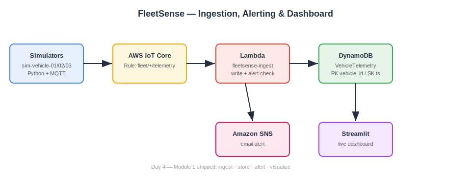

# FleetSense Pipeline

A connected-vehicle intelligence platform on AWS with a zero-hardware edge-AI
driving-behavior detector. Telemetry flows from simulated vehicles and a
simulated embedded node through IoT ingestion into a queryable store, with
real-time alerting and a live dashboard. A phone-trained TinyML model classifies
driving events (harsh braking, swerves) on the edge and ships *conclusions*
instead of *raw data*.

## Architecture

Pipeline (device to insight):

- **Vehicle simulators:** Python sims (`sim-vehicle-01/02/03`) publish telemetry
  (speed, RPM, coolant temp, battery voltage, GPS) over MQTT with injected
  anomalies.
- **Simulated embedded node:** a Wokwi ESP32 + MPU6050 running real Arduino/C++
  firmware (`firmware/esp32_node.ino`) publishes accelerometer data to a public
  MQTT broker — identical to what physical silicon would run (simulator-first
  development).
- **Bridge:** `bridge.py` subscribes to the public broker (`test.mosquitto.org`)
  and republishes into AWS IoT Core using device X.509 certs — a standard
  edge-broker-to-cloud-broker industrial pattern. It normalizes messages (adds an
  ISO timestamp) so the DynamoDB sort key is always present.
- **Edge AI:** an Edge Impulse model classifies `idle / normal / harsh_brake /
  swerve` from accelerometer windows. `virtual_ecu.py` runs the inference
  architecture with debouncing and publishes detected **events** to
  `fleet/<node>/events` — shipping conclusions, not raw streams.
- **Ingestion:** AWS IoT Core authenticates each device with an X.509 certificate
  and routes telemetry via a Rules Engine rule (`SELECT * FROM 'fleet/+/telemetry'`).
- **Processing:** `fleetsense-ingest` Lambda writes each reading to DynamoDB
  (floats → `Decimal`) and fires an SNS email alert when coolant temp exceeds a
  threshold.
- **Storage:** DynamoDB table `VehicleTelemetry` (PK `vehicle_id`, SK `timestamp`).
- **Visualization:** a Streamlit dashboard reads DynamoDB for a live fleet
  overview, per-vehicle charts, and an anomaly banner. It renders only the
  columns each device actually reports (heterogeneous, schema-tolerant fleet).

## Edge AI: model and on-device profile

Trained in Edge Impulse from phone accelerometer data (62.5 Hz), 2000 ms window /
1000 ms stride, spectral features, architecture dense-20 → dense-10.

- **Accuracy:** 89.7% · **weighted F1:** 0.90 · **ROC:** 0.97
- **Per-class F1:** idle 1.00 · normal 0.91 · swerve 0.86 · harsh_brake 0.79

On-device profiler estimates (Espressif ESP32 @240 MHz, EON Compiler — *estimated,
not measured on physical silicon*):

| | int8 | float32 |
|---|---|---|
| Latency (total) | 30 ms | 32 ms |
| RAM | 2.2 K | 2.2 K |
| Flash (classifier) | 15.1 K | 14.7 K |
| Accuracy | 89.29% | 91.07% |

Spectral feature extraction dominates latency (~29 ms) vs. 1–3 ms for the
classifier, so quantization buys almost nothing at this model scale. The EON
Compiler (same accuracy, ~54% less RAM, ~61% less ROM) does the real work.

## The business case: bandwidth

| Approach | Messages / hour / vehicle |
|---|---|
| Raw streaming (62.5 Hz × 3 axes, batched to 1 msg/sec) | ~3,600 |
| Event-only (harsh brakes and swerves are rare) | ~10 |

**~360× fewer messages** — plus far less storage and ingest cost. At fleet scale
this is the difference between a viable architecture and an unaffordable one, and
why the edge node ships **conclusions** rather than **raw data**.

## Setup

Prerequisites: an AWS account, AWS CLI configured (`aws configure`), Python 3.9+,
and a device certificate/key from AWS IoT Core.

1. Install dependencies: `pip install -r requirements.txt`
2. Register an IoT Thing in AWS IoT Core, download its certificate, private key,
   and the Amazon Root CA, and place them in `~/fleetsense/certs/`.
3. Get your IoT endpoint:
   `aws iot describe-endpoint --endpoint-type iot:Data-ATS`
4. Run a simulator (replace the endpoint with yours):
   `python3 src/vehicle_simulator.py --endpoint <your-endpoint>`
5. Launch the dashboard: `python3 -m streamlit run src/dashboard.py`

## Design decisions

- **MQTT over HTTP for ingestion.** Vehicles are intermittently connected and send
  small, frequent messages. MQTT's persistent pub/sub and QoS fit far better than
  HTTP's per-request overhead.
- **DynamoDB over a relational database.** The workload is high-volume,
  append-heavy time-series with a simple access pattern (by vehicle, by time).
  DynamoDB gives predictable low-latency writes and scales without server
  management; JOINs and rigid schemas aren't needed.
- **Serverless (Lambda + IoT Rules).** Telemetry is bursty, so scaling to zero
  when idle and up under load avoids paying for idle servers.
- **Edge inference over raw streaming.** Latency, cost, privacy, and offline
  operation all favor deciding on the device and sending only labels.
- **Least-privilege policies.** Devices can only connect as `sim-vehicle-*` /
  `bridge-*` and publish to `fleet/*/telemetry` and `fleet/*/events` — nothing more.

## Repo layout

- `/src` — simulators, ingest Lambda, dashboard, bridge, virtual ECU, query tool
- `/firmware` — Wokwi ESP32 + MPU6050 Arduino sketch
- `/docs` — design notes and lessons learned
- `/diagrams` — architecture diagram and dashboard demo

## Status

Day 8 of 20 — Module 1 shipped (ingest, store, alert, visualize) and a
zero-hardware edge-AI driving-behavior detector trained, profiled, and deployed
to the browser via WebAssembly.
